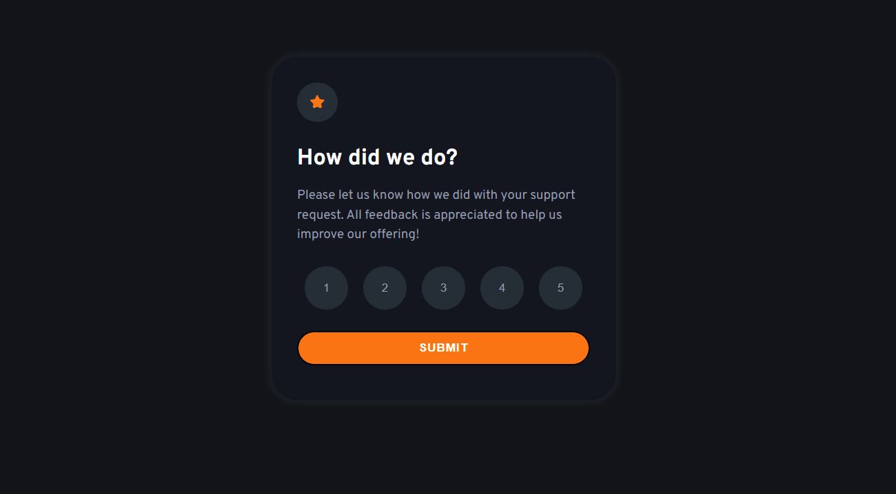

# Frontend Mentor - Interactive rating component solution

This is a solution to the [Interactive rating component challenge on Frontend Mentor](https://www.frontendmentor.io/challenges/interactive-rating-component-koxpeBUmI).

## Table of contents

- [Overview](#overview)
  - [The challenge](#the-challenge)
  - [Screenshot](#screenshot)
  - [Links](#links)
- [My process](#my-process)
  - [Built with](#built-with)
- [Author](#author)

## Overview

### The challenge

Users should be able to:

- See hover states for all interactive elements on the page
- Select and submit a number rating
- See the "Thank you" card state after submitting a rating

### Screenshot

### Links

- Solution URL: [GitHub solution](https://github.com/JonathanSamael/interactive-rating-card)
- Live Site URL: [Pages](https://jonathansamael.github.io/interactive-rating-card/)

## My process

### Built with

- Semantic HTML5 markup
- Flexbox
- Pseudo-class
- Events on JavaScript

## Author

- Instagram - [@jonathan_samael_](https://www.instagram.com/jonathan_samael_/)
- Frontend Mentor - [@JonathanSamael](https://www.frontendmentor.io/profile/JonathanSamael)
- LinkedIn - [@jonathan-amaral](https://www.linkedin.com/in/jonathan-amaral/)
